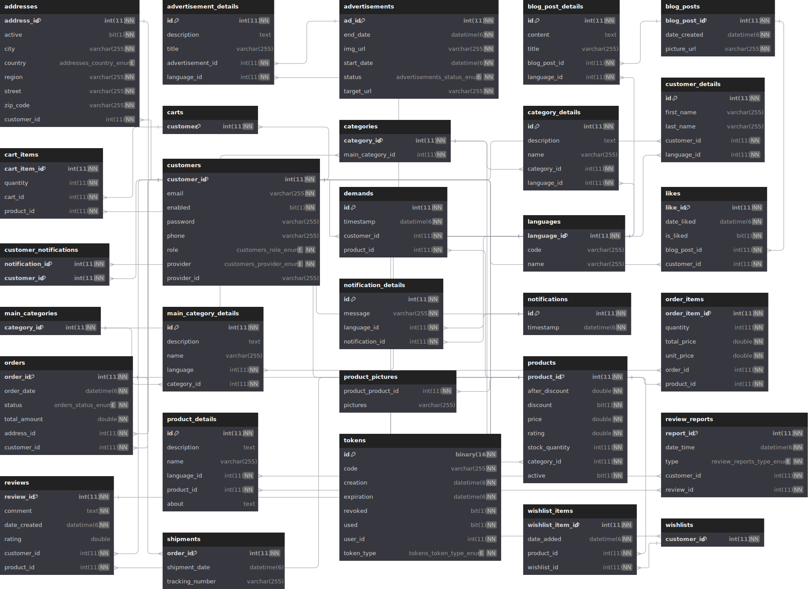

<h1 align="center">
   
  
   
  E - Commerce
   
</h1>

  <a href="#introduction">Introduction</a> •
  <a href="#overview">Overview</a> •
  <a href="#main-features">Main Features</a> •
  <a href="#dependencies">Dependencies</a> •
  <a href="#configuration">Configuration</a> •
  <a href="#download">Download</a> •
  <a href="#start-application">Start Application</a> •
  <a href="#how-to-use">How To Use</a> •
  <a href="#documentation">Documentation</a> •
  <a href="#license">License</a>

## Introduction
E-commerce, revolutionizes the way businesses and consumers interact in the digital age. It encompasses the buying and selling of products and services over the internet, making transactions seamless and accessible from anywhere with an internet connection.

## Overview

|        Information       |     Quantity      |
|:------------------------:|:-----------------:|
|       Java Classes       |       200+        |
|      Lines of Code       |       6K+         |
|         Entities         |       25+         |

* View database schema diagram on [dbdiagram.io](https://dbdiagram.io/d/E-Commerce-65ca0de8ac844320aef41179)
* Explore the database schema details on [dbdocs.io](https://dbdocs.io/ahmedukamel/E-Commerce)

## Main Features
* [X] Comprehensive Multilingual Support **(Internationalization - i18n)**
    - platform offers robust multilingual support (i18n) implemented at both database and coding levels, ensuring seamless communication and user experience across languages
* [X] Guest Browsing
  * Allow users to view and browse products and categories without requiring account creation, enhancing accessibility and user experience.
* [X] Role-Based Access Control **(RBAC)**
  1. ***Customer:*** Represents the end-users who browse and make purchases on the platform
  2. ***Super Admin:*** Manages system-wide user accounts, with the ability to enable or disable accounts and assign or modify user roles as needed
  3. ***Admin:***
     - Manage categories and sub-categories
     - Manage products and pricing
     - Oversee customer notifications
     - Monitor product reviews and review reports
     - Track demand for unavailable products
  4. ***Delivery:***
     - Access all prepared orders awaiting delivery
     - Manage order statuses and shipment details
  5. ***Content Creator:*** Manages advertisements and blog posts
* [X] Authentication via Json Web Tokens **(JWT)**
* [X] Account Management
  * Allow users to manage their profiles, and addresses
* [X] Category and Sub-category Navigation
  * Explore and refine search results effortlessly by organized categories and sub-categories
* [X] Wishlist
  * list of favorite products for future reference or purchase, facilitating easy access and organization of desired items
* [X] Notifications
  * Provide users with the option to receive alerts and notifications for price reductions or product restocks on items saved in their wishlist, ensuring they stay informed about relevant updates and opportunities
* [X] Product Review and Rating System
  * Enable customers to provide feedback and ratings for products, facilitating informed decision-making for other shoppers
  * Additionally, provide the functionality to report reviews as necessary
* [X] Order Tracking
  * Allow customers to track the status of their orders in real-time, providing updates from processing to delivery.
* [X] Compatibility Across Platforms
  - Supported on *Linux*, *macOS*, and *Windows*

## Dependencies
* **JDK 17**
  - Visit the official Oracle website and choose an operating system file from [here](https://www.oracle.com/java/technologies/javase/jdk17-archive-downloads.html)
  - Follow the provided installation instructions tailored to your operating system

* **MySQL Installation**
  - Download the installer from the official MySQL website [here](https://dev.mysql.com/downloads/mysql/)
  - Proceed with the installation steps specific to your operating system

## Configuration
- Write the following commands in `MySQL Command Line Client` to create user, grant privileges, and create database.
~~~sql
CREATE USER 'ecommerce_user'@'localhost' IDENTIFIED BY 'password_ecommerce';
~~~
~~~sql
GRANT ALL PRIVILEGES ON * . * TO 'ecommerce_user'@'localhost';
~~~
~~~sql
FLUSH PRIVILEGES;
~~~
~~~sql
CREATE DATABASE e_commerce_api_database;
~~~

## Download
You can find the JAR file for download by accessing the repository. Simply click `Download ZIP` on the repository link or click [here](https://github.com/AhmedUKamel/E-Commerce/archive/refs/heads/main.zip) to access the repository files. Alternatively, you can use Git by following the command below:

~~~bash
git clone https://github.com/AhmedUKamel/E-Commerce.git
~~~

## Start Application
~~~bash
cd path/to/E-Commerce
~~~
~~~bash
java -jar ecommerce-0.0.1-SNAPSHOT.jar
~~~
**Output**

    INFO 49785 --- [  restartedMain] o.s.b.w.embedded.tomcat.TomcatWebServer  : Tomcat started on port 8080 (http) with context path ''
    INFO 49785 --- [  restartedMain] o.a.ecommerce.EcommerceApplication       : Started EcommerceApplication in x seconds (process running for x)

## How To Use
* Open preferred browser and go to **http://localhost:8080** or **http://127.0.0.1:8080**

**Output**

  

## Documentation
To utilize the e-commerce APIs effectively, please refer to the comprehensive documentation provided through Postman. This documentation offers detailed insights into the available endpoints, request parameters, and response formats.

Access the documentation here: [Documentation on Postman](https://documenter.getpostman.com/view/26297954/2s9YysBLzk#f94594c2-abc2-4ec9-a081-799976c08d65)

## License
This project is licensed under the MIT License - see the [LICENSE](LICENSE) file for details.

---

  Follow me on <b>LinkedIn</b>
  <a href='https://www.linkedin.com/in/ahmedukamel' target='_blank'>@ahmedukamel</a>

